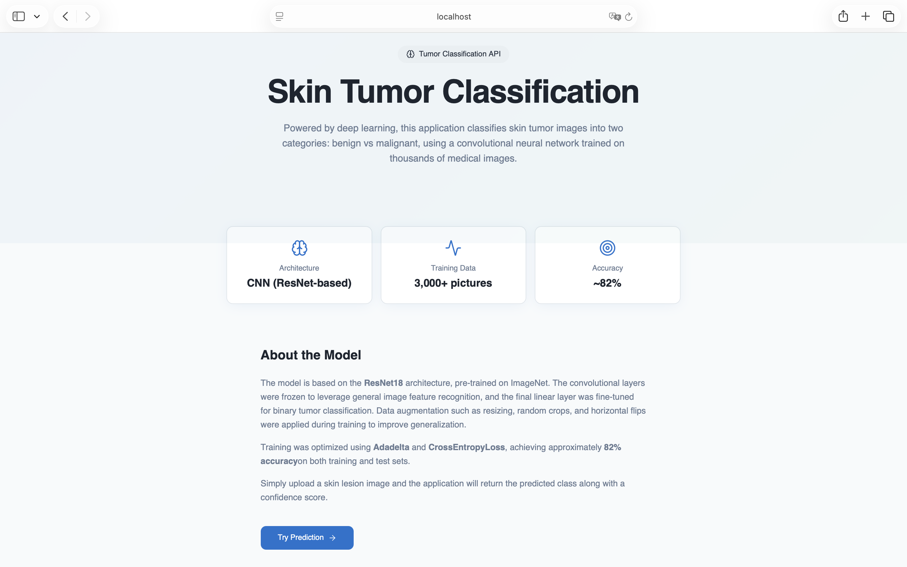
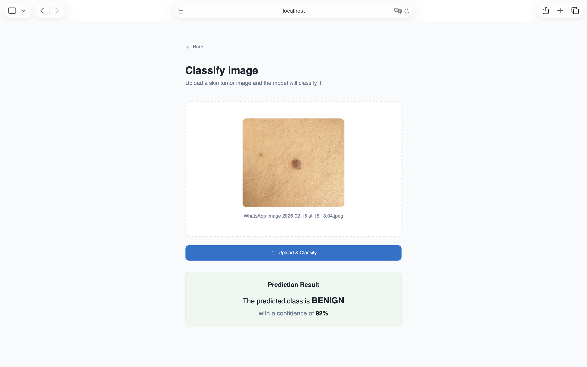

# Tumor Classification API

This version of the project provides an API to classify image of skin tumors (benign/malignant).
It includes endpoints to upload images, obtain the HTML form and unit testing with pytest.
- ⁠API built with *FastAPI*.
- *Python* API backend.
- *React* frontend created with *Lovable* and integrated with backend.
- Structured logging with console outpout.
- Exception handling with `HTTPExceptions` from *FastAPI/Starlette*.
- Unit tests with *pytest*.

For instructions on running the app with Docker, see [README.Docker.md](README.Docker.md)

## Model context

The model is a PyTorch model trained in a prior phase using **Transfer Learning**:

- **ResNet18 pre-trained** on ImageNet was used.
- The convolutional layers were frozen to leverage general image pattern recognition.
- The final linear layer was replaced to output **binary classification**: benign vs malignant tumor.
- The dataset used was from Kaggle: `fanconic/skin-cancer-malignant-vs-benign`.
- Data augmentation was applied to the training set (resize, random crop, horizontal flips) and basic normalization for the test set.
- Optimization with `Adadelta` and `CrossEntropyLoss`.
- Achieved ~82% accuracy on both training and test sets.

> Note: **Training code is not included** in this repository. Only the final weights (resnet_skin.pth) are included in the root directory for loading, with @lru_cache to avoid loading it for every client call.

---

## Clone repository

Clone the repository and its basic dependencies.

Using git:

```bash
git clone https://github.com/olivia28c-creator/classify_tumor
````
The repository will then be cloned into the current working directory. Then, navigate to the root of the `classify_tumor` repository:

```bash
cd classify_tumor
```

Head to the branch _fast-api_:

```bash
git switch -q fast-api
```
You are all set for installing the dependencies and running the application.

---

## Install dependencies and run app

It is necessary to set the frontend and the backend up separately in two different terminals.

### 1) Frontend
From the project root `classify_tumor`, navigate into the frontend folder:
```bash
cd frontend
````
Install dependencies:
```bash
npm ci
```
Start the dev server:
```bash
npm run dev
```

### 2) Backend

Open a new terminal and navigate into the `classify_tumor` repository.
Previously to installing any dependencies, it is strongly recommended to use a virtual environment:

```bash
python -m venv venv
source venv/bin/activate    # macOS/Linux
venv\Scripts\activate       # Windows
```
Install dependencies:

```bash
pip install -r requirements/all.txt
```
For optional development dependencies such as mypy and pytest:

```bash
pip install -r requirements/dev.txt
```
Key dependencies:
- ML: torch and torchvision
- API: fastapi, uvicorn and starlette

Run the app:

```bash
uvicorn app.main:app --reload
```
Or rather:

```bash
fastapi run app/main.py
```
For development mode, use:
```bash
fastapi dev app/main.py
```

>Note: check the frontend terminal to see the IP direction where the app will be served. In most cases, it will be [http://localhost:8080/](http://localhost:8080/)

---
## Web UI

The application exposes a full web interface with the frontend integrated and served by the backend.


### Pages

1) Home page - [http://localhost:8080/](http://localhost:8080/)
    - What you should see: a landing page with the app title, a short description, and a **Try Prediction** button.
    

2) Predict page - [http://localhost:8080/predict/](http://localhost:8080/predict/)
    - What you should see: an image upload form (drag & drop or file picker) and a **Upload & Classify** button.
    - Returns: the tumor classification prediction along with the model's confidence (percentage).
    

---

## API Endpoints

Uvicorn will serve the FastAPI app by default at [http://localhost:8000/](http://localhost:8000/)

### *GET /api/health*
Returns welcome message.
[http://localhost:8000/api/health/](http://localhost:8000/api/health/)

### *GET /api/predict/*
Returns a basic HTML form to upload the file.
[http://localhost:8000/api/predict/](http://localhost:8000/api/predict/)

### *POST /api/upload/*
Accepts an image file and returns the prediction.
[http://localhost:8000/api/upload/](http://localhost:8000/api/upload/)
> Note: This is a POST path operation. Opening it directly in the browser will show an error (405) because only GET requests can be accessed via URL, and this operation does not define a GET method.

**Response example:**

{
"predicted_class": "benign",
"confidence": 0.87
}

**Exceptions handled:**

- No file → 400 (Bad request)
- File is not a valid image → 400 (Bad request)
- Any other exception → 500 (Internal server error)

You can check all the API functionalities and complete documentation at:

[http://localhost:8000/api/docs/](http://localhost:8000/api/docs/)

---

## Tests

To run the tests, from root directory:

```bash
pytest
```


